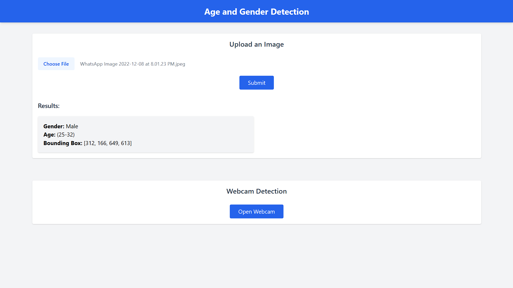

# Age and Gender Detection Application

 

This is a Flask-based web application that detects age and gender from uploaded images or webcam captures. It leverages pre-trained deep learning models with OpenCV for accurate detection and classification.


---

## Features

- Upload an image to detect age and gender.
- Supports multiple image formats (e.g., JPG, PNG, AVIF, etc.).
- Capture images from a webcam for real-time detection.
- Displays detected age and gender along with bounding boxes for faces.
- User-friendly interface built with TailwindCSS.

---

## Installation

### Prerequisites
- Python 3.8 or later
- Pip (Python package installer)

### Clone the Repository
```bash
git clone https://github.com/Nikeshchaudhary52494/ageAndGenderRecogination.git
cd ageAndGenderRecogination
```

### Install Dependencies
```bash
pip install -r requirements.txt
```

### Start the Flask server:
```bash
python app.py
```

### Open a web browser and go to:
```bash
http://127.0.0.1:5000
```
---

# File Structure
- data/: Contains pre-trained model files for face, age, and gender detection.
- templates/: HTML templates (index.html for the main page and webcam.html for webcam integration).
- main.py: The main Flask application.
- requirements.txt: Python dependencies for the application.

--- 

## Models Used
1 Face Detection:
 - opencv_face_detector.pbtxt
 - opencv_face_detector_uint8.pb
2 Age Detection:
 - deploy_age.prototxt
 - age_net.caffemodel
3 Gender Detection:
 - deploy_gender.prototxt
 - gender_net.caffemodel
